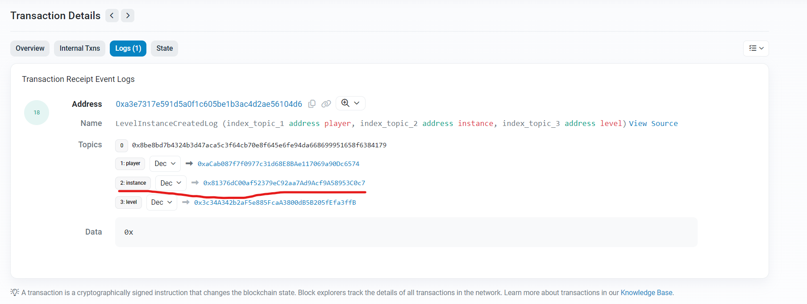
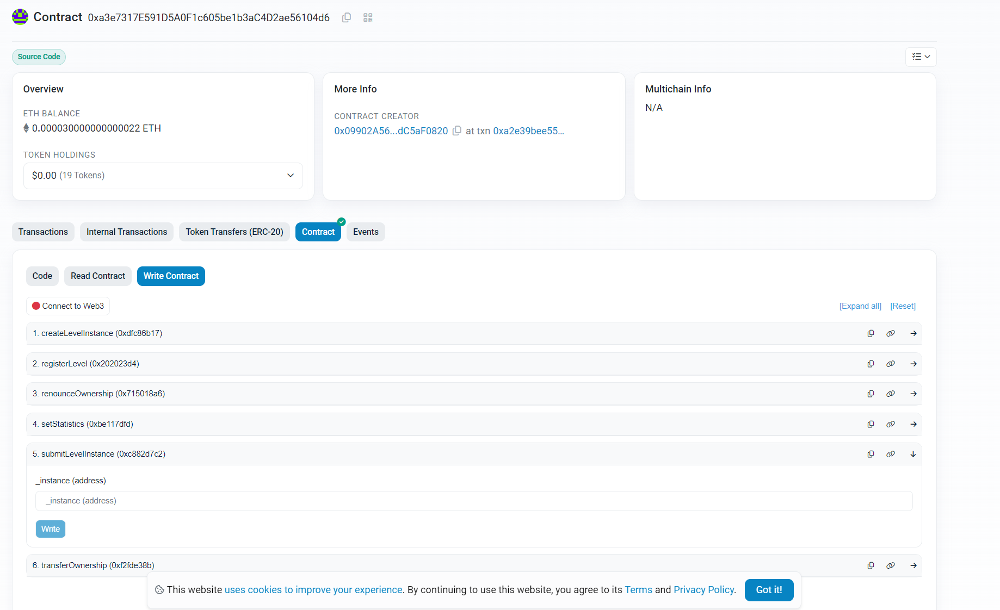
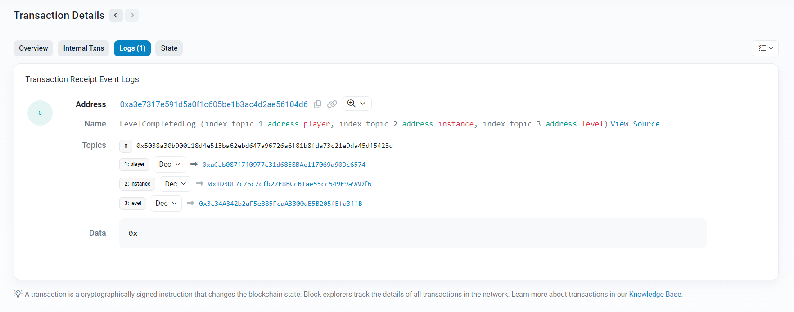

# Ethernaut Writup

题目：https://ethernaut.openzeppelin.com/

## 解题步骤

在题目中点击生成实例，从[交易](https://sepolia.etherscan.io/tx/0x257c6f7e0cda98ff7f73ca13af157d1af0c7049c4b9a4bdcd14ff760b54202bd)中获取到生成的instance


首先把题目的合约复制下来，放在src文件夹里，然后在test文件夹里写相应的测试，一切都没问题后，将在script里写需要执行的操作，然后执行即可。

完成之后在题目中点击提交实例，或者在[合约](https://sepolia.etherscan.io/address/0xa3e7317e591d5a0f1c605be1b3ac4d2ae56104d6#writeContract)上提交instance即可


成功后会有[LevelCompletedLog](https://sepolia.etherscan.io/tx/0x4d71303797a8c6452f856ada104f0f240691d5b59f827c9bf5c4ea2235ba7d86#eventlog)




## 参考

https://book.getfoundry.sh/

https://learnblockchain.cn/docs/foundry/i18n/zh/index.html

https://decert.me/tutorial/solidity/tools/foundry

## 常用命令

### forge测试

```shell
forge test -vvvv --match-test testFallback
```

从指定fork后再运行测试

```shell
forge test -vvvv --match-test testFallback --fork-url <url>
```

### forge运行脚本

```shell
forge script script/Fallback.s.sol --broadcast --rpc-url <your_rpc_url> --private-key <your_private_key>
```
